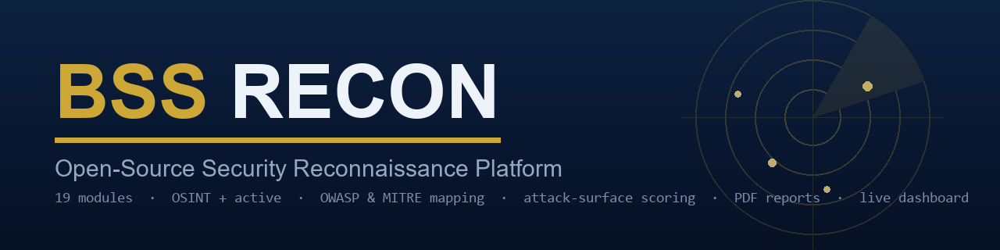

<p align="center">
  
</p>

<h1 align="center">BSS Recon</h1>

**Open-source security reconnaissance platform built for penetration testers, bug bounty hunters, and security teams.**

BSS Recon runs 19 scanning modules against a target domain — passive OSINT and active probing — then maps every finding to OWASP Top 10 and MITRE ATT&CK categories, scores the overall attack surface, and generates a professional PDF report. Includes a real-time web dashboard for live scan monitoring.

Built and maintained by [Emilio Burgohy](https://github.com/ebuggy84).

---

## Features

- **19 scanning modules** covering DNS, subdomains, SSL, WHOIS, web probing, JS analysis, WAF detection, and more
- **OWASP Top 10 + MITRE ATT&CK mapping** on every finding
- **Attack surface scoring** — composite 0-100 score with severity breakdown
- **Web dashboard** with live scan progress, animated gauges, severity donut chart, and module status tracking
- **PDF + Markdown reporting** — branded, client-ready assessment reports
- **Traffic Analyzer** — paste Burp HTTP history, extract endpoints, surface IDOR candidates
- **Phishing Analyzer** — paste email headers, get SPF/DKIM/DMARC verdicts and red flag detection
- **Monitor mode** — scheduled re-scans with diff tracking to detect changes over time
- **Modular architecture** — enable/disable individual modules, run passive-only or full active scans

---

## Modules

| Module | Type | Description |
|--------|------|-------------|
| DNS | Passive | DNS record enumeration (A, MX, TXT, NS, SOA) |
| WHOIS | Passive | Domain registration and ownership lookup |
| SSL | Passive | SSL/TLS certificate analysis and expiration check |
| Subdomains | Passive | Subdomain discovery via Certificate Transparency |
| SubMutate | Active | Async DNS mutation engine (500-1000 queries/sec) |
| Wayback | Passive | Historical URL discovery via Internet Archive CDX API |
| VirusTotal | Passive | Domain/IP reputation and threat intelligence (API key required) |
| Shodan | Passive | Exposed service and port lookup (API key required) |
| Hunter.io | Passive | Email address discovery (API key required) |
| Google Dorks | Passive | OSINT query generation for manual investigation |
| Nmap | Active | Port scanning and service detection |
| Nuclei | Active | Vulnerability template scanning |
| Web Probe | Active | Path/file discovery with smart 404 fingerprinting |
| WAF Detect | Active | Web application firewall identification |
| Tech Detect | Active | Technology stack fingerprinting |
| Headers | Active | HTTP security header analysis |
| JS Analyzer | Active | JavaScript secret and endpoint extraction |
| Diff Tracker | Analysis | Change detection between scans |
| Score | Analysis | Composite attack surface scoring (0-100) |

---

## Quick Start

### Prerequisites

- Python 3.10+
- Git

### Installation

```bash
git clone https://github.com/ebuggy84/bss-recon.git
cd bss-recon
python3 -m venv venv
source venv/bin/activate
pip install -r requirements.txt
cp config.yaml.example config.yaml
```

### Add API Keys (Optional)

Edit config.yaml and add your keys for enhanced scanning:

```yaml
shodan:
  api_key: "your-shodan-key"
virustotal:
  api_key: "your-virustotal-key"
hunter:
  api_key: "your-hunter-key"
```

Modules that require API keys will skip gracefully if no key is configured. The tool works out of the box with passive modules that don't need keys.

### Run Your First Scan

```bash
# Passive scan with report
python -m bssrecon scan example.com -r

# Generate PDF report from scan results
python -m bssrecon report example.com -f pdf

# Monitor mode - rescan every 6 hours and track changes
python -m bssrecon scan example.com -r --monitor 6
```

### Launch the Web Dashboard

```bash
source venv/bin/activate
cd bss-dashboard/backend && uvicorn main:app --host 0.0.0.0 --port 8000 &
cd ../frontend && python3 -m http.server 3000 --bind 0.0.0.0 &
```

Open http://localhost:3000 in your browser.

---

## Dashboard

The web dashboard provides real-time scan monitoring with:

- Animated per-module status gauges (pending to running to done)
- Attack surface score gauge (0-100 with color zones)
- Severity breakdown donut chart (Critical/High/Medium/Low/Info)
- Findings table with OWASP and MITRE ATT&CK mapping
- JSON and PDF export
- Traffic Analyzer for IDOR candidate detection
- Phishing Analyzer for email header analysis

---

## Project Structure

```
bss-recon/
├── bssrecon/
│   ├── core/           # 19 scanning modules
│   ├── reporting/      # PDF and Markdown report generators
│   ├── frameworks/     # OWASP/MITRE mapping definitions
│   ├── tools/          # Utility tools
│   ├── utils/          # Helper functions
│   ├── wordlists/      # Custom wordlists for subdomain mutation
│   ├── cli.py          # CLI entry point and orchestrator
│   └── config.py       # Configuration loader
├── bss-dashboard/
│   ├── backend/        # FastAPI server
│   └── frontend/       # React dashboard (single HTML file)
├── config.yaml.example # Template configuration
├── requirements.txt    # Python dependencies
└── LICENSE             # MIT License
```

---

## Reporting

BSS Recon generates professional assessment reports in PDF and Markdown formats:

- **Cover page** with target, date, and analyst name
- **Executive summary** with severity breakdown
- **Findings table** with OWASP category and MITRE technique mapping
- **Detailed findings** with remediation guidance
- **Disclaimer and scope** documentation

---

## Legal

This tool is intended for authorized security testing only. Always obtain written permission before scanning any target you do not own. Unauthorized scanning may violate computer crime laws.

## License

[MIT License](LICENSE) — free to use, modify, and distribute.

## Author

**Emilio Burgohy** — [GitHub](https://github.com/ebuggy84) | [LinkedIn](https://linkedin.com/in/emilioburgohy)
